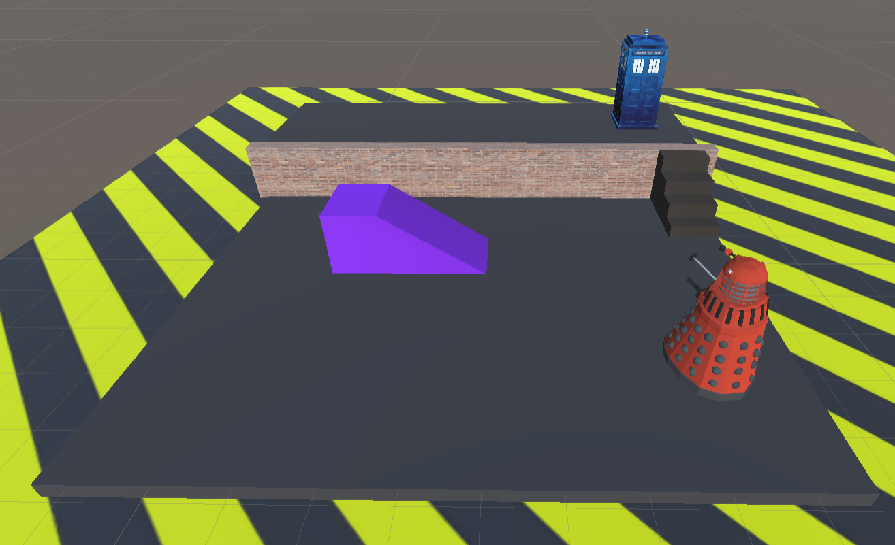
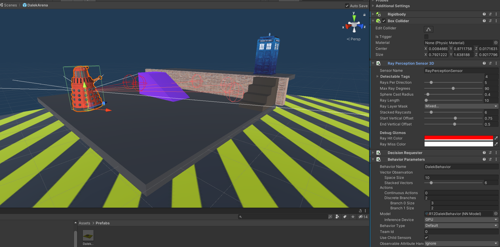
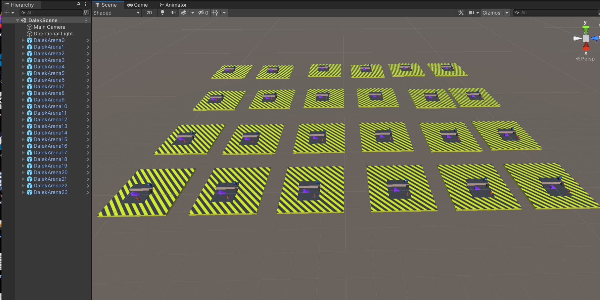
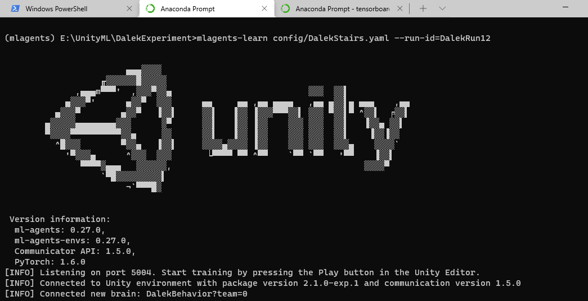
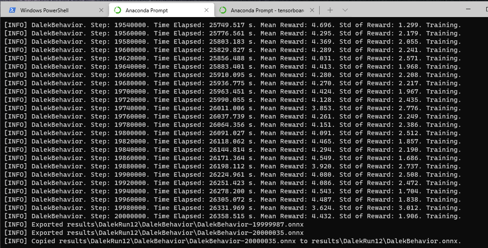
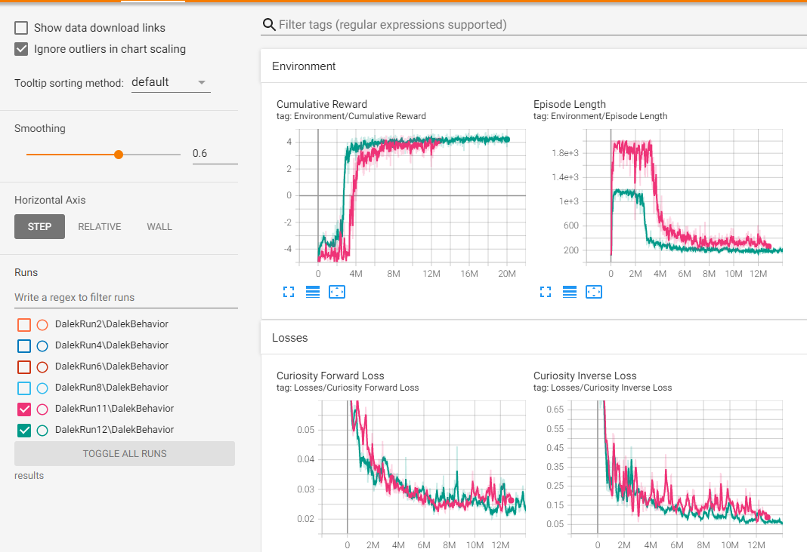

# DalekSteps - Train a Dalek To Avoid the Stairs !

This is an application of Unity ml-agents Reinforcement Learning to help a Dalek navigate as an alternative to the use of Stairs.

The Dalek has to find a way to reach the Tardis, which is on another ground level. Daleks cannot climb steps ! 

Please see the YouTube Video Here. 

## Overview    ##
Note there is no pursuit of the Tardis pre programmed into the Dalek agent. It will only discover that this is a Positive reward objective upon a successful encounter with the Tardis object. So this is a very sparse and challenging Reward Environment. The Agent undegoes a lot of  a lot of failures (Falling off the platform, losing the ramp object etc), random movements before it discovers the positive objective to reach the Tardis, and hence on how best to achieve it. The scenarios are trained against different Dalek and Ramp random start initial positions and orientations.

After around 10 Million Training Steps the Dalek learns to move the ramp, and to get onto the higher ground and approach the Tardis reasonably well. There are however still some  stuck/failed scenarios the agnets policy cannot cope with. 

This is an introductory ml-agents projects, loosely based around experience of the Unity WallJump examples. There is a single Agent script, to understand and modify the Agent Behaviours. Hopefully you can find some improvements to the training time or the eventual perfomance. 

This project is based upon Ml-Agents Release 18  (Python Package 0.27.0 and Unity Package 2.1.0). The Unity ml-agents 2.1.0 package runtime is included here. 

The Trained Brain is configured into the project, so the Unity Scene can be already be played through with the Trained Brain, without the need to perform any further python Training. 

## Design Overview: Observations and Actions  ##

Please see the /Assets/Prefab Folder, for the DalekArena. This Prefab has the design for a Dalek Arena, including the Dalek, Agent, with the Agent Scripts etc. The Ramp Rigid body moveable GameObject, and the fixed Wall, Ground and Tardis GameObjects. Note that this DalekArena Prefab is replicated 24 Times, in the Scene to speed up Training performance.  

The Dalek Agent is configured with the following Observations:
  - Dalek Forward RayCasts, which can Detect tagged Walls, The Ramp, Steps, Tardis (only if on higher ground level)
  - Position of Dalek (Vector 3), local relative to the Wall  
  - Position of Ramp (Vector 3)  local relative to the Wall
  - Ramp Orientation (float) around Y axis 
  - Delta Vector to Tardis  (Vector3) 

Note, as per the WallJump example, the Observation Vectors and ray casts are stacked by an order of six Times, presumbably to detect motion. A Decision Requester takes actions at 5x. 

The Dalek Movements are controlled with two Action Branches:
  - Rotation around Y Axis Discrete Action Branch  (0 : None, 1: Turn Left, 2: Turn Right) 
  - Move Forward Discrete Action Branch   (0: None, 1:Move Forward (Dalek local Z Axis))

All changes and modifications to the Dalek Agent should be made within the context of the Dalek within the DalekArena Prefab. The Dalek Arena is replicated 24 times to improve training speed. 

 
### Reward Signals ###
The Agent and the Game Environment are all ahndled within the single /Assets/Scripts/DalekController.cs script.  This script controls the Dalek Behvaiors, Episode Management, Overrides the ML Agents Initialise(), CollectObservations() and OnActionReceived() and Heuristic() etc as well as assign the Reward signals.
There are four Distinct Rewards
   - +5.0f Episode Success (Dalek Reaches the Tardis)
   - -5.0f Episode Failure (Dalek or the Ramp Falls off the Arena Platform)
   - -2.0f Excessive Episode Length (Episode steps exceeds 6000)
   - An accumlatative -0.00025f  upon every ActionReceived 
 
The Dalek can be manually controlled, if the Dalek Agent Behaviour is set into Heuristic mode, within the Agent Behavior Component. The Manual Controls are then: Left/Right Arrows to Rotate, and Space Bar to Move Forward.  
## Training ##
The Dalek Agent has been trained using the Unity-ML:  PPO + Curiosity Algorithm. Please see the /config/DalekStairs.yaml for details  

To perform mlagents Training within an appropriate python mlagents environment using this algorithm configuration:  

(mlagents) $:> mlagents-learn config/DalekStairs.yaml  --run-id=DalekRunXX

This will take a long time to learn a reasonable agent policy. Experience suggests around 12 Million Epochs, but with an initial Reward Growth around 4 Million Epochs. 

The initial 4 Million or so steps are mostly negative episodes, with few if any discoveries of the Positive Reward signal, since the Environment is very Sparse. However the cumulative grows towards being positive around 4 Million epochs, and then from 6 Million Epochs the rewards gently grows. With a Curiosity ICM component the Agent is also rewarding itself in exploring the state space, and so the agent needs to reduce its curiosity losses (Foward and Inverse Nueral Networks). These network show a steady loss decline over 12 Million epochs.

## Observations and Performance ##
- The Training Time still feels a little excessive. Despite Increasing the Learning rates from the default 0.0003 to 0.00075, the Reward signals still grow very slowly in the final Training Phase.
- There are still some skip across the gaps from Ramp to Higher Ground. The Dalek Collision Box has been reduced, and could perhaps be reduced further. But that makes the environment even more challenging.
- There are some stuck scenarios in the Trained policies.  The Dalek still sometiems moves the ramp towards the Left edge of the arena, where it has no reasonable access, or ability to move the ramp closer to the Wall. This is a failed scenario, and the Agent typically goes into a sulk, waiting out the Episiode by some repeated manoeuvres around the steps. 

So any suggestions or recommendations on improving the performance are welcome. 

Cheers

